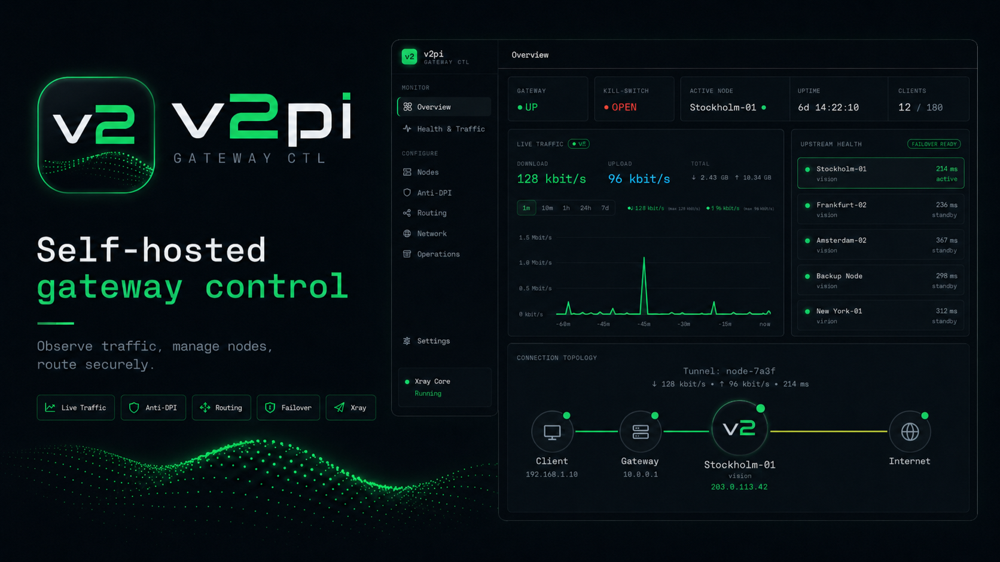

<div align="center">



<br/>

**Превращает любую headless Linux-машину в управляемый [Xray](https://github.com/XTLS/Xray-core) VPN-шлюз** — ноды, тюнинг anti-DPI, маршрутизация по правилам, автопереключение (failover) на живую ноду и полное управление сетью хоста, из одного веб-дашборда со светлой и тёмной темой. Без монитора и клавиатуры.

<br/>

[](https://github.com/pinusmassoniana/v2pi/actions/workflows/ci-release.yml)
[](https://github.com/pinusmassoniana/v2pi/releases)
[](LICENSE)
[](https://github.com/pinusmassoniana/v2pi/pkgs/container/v2pi-x)


<br/>

[English](README.md) · **Русский**

[Зачем](#зачем-v2pi) · [Возможности](#возможности) · [Быстрый старт](#быстрый-старт-docker) · [Настройка роутера](#настройка-роутера) · [Конфигурация](#конфигурация) · [На чём протестировано](#на-чём-протестировано) · [Разработка](#разработка)

</div>

## Зачем v2pi?

Интернет в России теперь с сюрпризами: то один сайт «недоступен», то другой открывается через раз, то
видео грузится по полдня. Стандартный ответ — накатить VPN-приложение. Вот только приложение живёт на
одном устройстве, само периодически отваливается или улетает из магазина, а телевизор, игровую
приставку, умные лампочки и телефон гостя им всё равно не прикроешь.

**v2pi заходит с другой стороны: вы защищаете не каждое устройство по отдельности, а всю сеть разом.**
Одна небольшая коробка, которая работает круглосуточно, становится шлюзом для целого сегмента сети. Всё,
что в него попало — по кабелю или по Wi-Fi, с VPN-клиентом или без, — прозрачно уходит в туннель
[Xray](https://github.com/XTLS/Xray-core). Настраивать каждое устройство отдельно не нужно: подключил к
сети — и оно уже под защитой. Для домашних всё выглядит буднично: интернет снова открывается целиком,
почти как в 2007-м.

И работает это **с умом**, а не «завернуть вообще всё в один прокси и молиться»:

- **В туннель уходит только то, чему он действительно нужен.** Правила geoip/geosite пускают российские
  и локальные сайты напрямую — банки, госуслуги и местные сервисы работают как обычно и быстро, — а
  через прокси идёт только то, что иначе не открыть. Пресет **«RU напрямую»** включается в один клик.
- **Сделано, чтобы реально проходить.** VLESS Vision / XHTTP / REALITY и тонкая настройка anti-DPI для
  каждой ноды (uTLS-fingerprint, фрагментация TLS, mux, DoH) применяются **на лету** — чтобы для DPI это
  выглядело как обычный трафик, а не «ага, снова VPN, режем».
- **Fail-closed по умолчанию.** Упал туннель — kill-switch не даёт трафику утечь в обход: вместо тихого
  отката на «голое» соединение вы просто остаётесь без сети, пока связь не поднимется. Никаких
  незаметных протечек.
- **Держится сам.** Легла одна нода — активные проверки молча переключают трафик на живую; после
  перезагрузки шлюз сам поднимается в рабочем состоянии. Ночью бежать передёргивать провода не придётся.
- **Ваше, а не подписка.** Крутится на вашем железе — недорогой Pi или любой мини-ПК — без стороннего
  приложения, которое в любой момент могут заблокировать, и без клиента на каждом устройстве. А живой
  NOC-дашборд показывает трафик, состояние нод и все выданные адреса.

Это **не** привязано к Pi: подойдёт любой x86-64 мини-ПК, тонкий клиент или VPS, либо любой arm64
одноплатник (Raspberry Pi, Orange Pi, Radxa Rock, NanoPi…), на котором запускается Docker. Образ
публикуется для [обеих архитектур](#на-чём-протестировано); Raspberry Pi 5 — просто референсное устройство.

## Возможности

<table>
<tr>
<td width="50%" valign="top">

### 🔌 Ноды
Управление нодами Xray — VLESS Vision / XHTTP, включая **XHTTP-over-TLS**. Подписки с инъекцией
произвольных заголовков / query-параметров и упорядоченным импортом.

</td>
<td width="50%" valign="top">

### 🛡️ Тюнинг anti-DPI
Профили для каждой ноды: uTLS-fingerprint, фрагментация TLS, mux, DoH, QUIC и другие anti-DPI ручки —
применяются **на лету**, без обрыва туннеля.

</td>
</tr>
<tr>
<td width="50%" valign="top">

### 🧭 Маршрутизация
Упорядоченные правила (`geoip` / `geosite` / domain / ip / port → direct / proxy / block) со стейджингом
пресетов, валидацией каждого правила и готовым пресетом **«RU напрямую»**.

</td>
<td width="50%" valign="top">

### 📈 Здоровье и трафик
Активные пробы с **автопереключением** на живую ноду плюс график входящего и исходящего трафика в
реальном времени по статистике Xray через WebSocket.

</td>
</tr>
<tr>
<td width="50%" valign="top">

### 🌐 Управление сетью
Редактируемая сеть шлюза (интерфейс / IP сегмента, диапазон DHCP, DNS для клиентов) с **fail-closed
kill-switch**, применяется к хосту как реальный nftables tproxy + policy-routing.

</td>
<td width="50%" valign="top">

### 🧰 Эксплуатация
Резервное копирование / восстановление, настройка администратора при первом запуске, светлая/тёмная
тема и самовосстановление после перезагрузки — коробка поднимается чистой.

</td>
</tr>
</table>

## Быстрый старт (Docker)

**Требования:** 64-битный **Linux**-хост (amd64/x86-64 или arm64/aarch64, headless — норма) с
**Docker** + **Docker Compose**.

**Деплой** — установка с нуля:

```bash
git clone https://github.com/pinusmassoniana/v2pi.git
cd v2pi
docker compose pull      # скачать готовый мультиарх-образ — Docker сам берёт нужную арку, без сборки на устройстве
docker compose up -d
```

Откройте `http://<ip-устройства>:8080` и пройдите настройку администратора при первом запуске. Секрет
сессии генерируется автоматически и сохраняется в data-томе; панель слушает `0.0.0.0` (доступна по
локальной сети, защищена логином).

**Обновление** до свежего опубликованного образа:

```bash
cd v2pi
git pull                 # обновить docker-compose.yml, если менялся
docker compose pull
docker compose up -d
```

> [!WARNING]
> Готовый Compose-файл запускает контейнер **`privileged`** с **`network_mode: host`**, чтобы он сам
> владел всем шлюзом на хосте (sysctl, клиентский VLAN, адресация, DHCP, IPv6 RA). Это выделенная
> коробка под одну задачу — таков размен.

Опубликованный образ — `ghcr.io/pinusmassoniana/v2pi-x`: мультиарх-манифест (`linux/amd64` +
`linux/arm64`), тег `:latest` плюс тег на каждую версию (например `:1.14`); `docker compose pull` сам
подбирает архитектуру хоста. Контейнер полностью самодостаточен: внутри уже лежат зафиксированный
**Xray-core** плюс `nftables` / `dnsmasq` / `isc-dhcp-client` / `iproute2`, и при `up` он сам
разворачивает весь шлюз на хосте — так что хосту не нужно ничего, кроме Docker, а вам — только настроить
роутер.

<details>
<summary><b>Сборка из исходников</b> (разработка / локальные правки)</summary>

<br/>

Замените две строки `compose` выше на локальную сборку (соберётся под арку самого хоста):

```bash
docker compose up -d --build
```

</details>

## Настройка роутера

Панель владеет шлюзом; роутер — **единственная коробка, которую она не трогает**. Настройте его один раз:

- Создайте клиентский VLAN (по умолчанию **VLAN 2**) и протегируйте в него клиентский порт свитча.
- **Отключите DHCP роутера** на этом VLAN — его раздаёт шлюз.
- Домашнюю ногу шлюза (`eth0`) держите в обычной LAN с интернетом.

> [!IMPORTANT]
> Если используете IPv6 — **отключите IPv6 / Router Advertisement роутера** на этом VLAN: RA раздаёт сам
> шлюз, а второй источник заставит клиентов течь мимо туннеля. Панель это детектит и показывает красный
> баннер.

Экран **Network** визуально проверяет каждый пункт и показывает точные шаги.

<details>
<summary><b>Миграция существующей ручной установки</b></summary>

<br/>

Если раньше вы вручную поднимали `pi-gw-dhcp.service` / `radvd` / VLAN — один раз запустите на хосте от
root `scripts/migrate-host.sh`: он снимет снапшот, остановит легаси-сервисы хоста, передаст сегмент
контейнеру и проверит результат (с откатом при ошибке). Чистым установкам это не нужно.

</details>

## Конфигурация

> [!TIP]
> Всё опционально — значения по умолчанию работают «из коробки». Переопределяется через `.env` (см.
> [`.env.example`](.env.example)) или переменные окружения.

| Переменная | По умолчанию | Назначение |
|---|---|---|
| `PI_GW_SESSION_SECRET` | генерируется, сохраняется | ключ подписи cookie сессии |
| `PI_GW_BIND_HOST` | `0.0.0.0` | адрес прослушивания (доступ по LAN, под логином) |
| `PI_GW_PORT` | `8080` | HTTP-порт |
| `PI_GW_DATA_DIR` | `/data` (в образе) | SQLite + конфиг Xray + логи + секрет сессии |
| `PI_GW_XRAY_BIN` | `xray` | путь к бинарю Xray |
| `PI_GW_NET_BACKEND` | `linux` (Compose) / `dryrun` (dev) | `linux` применяет nft + routing + dnsmasq к хосту; иначе — только рендер |

> [!NOTE]
> Dev / CI по умолчанию используют **dry-run** сетевой бэкенд (`PI_GW_NET_BACKEND` не задан или
> `dryrun`): он рендерит наборы правил nftables + dnsmasq, но не трогает хост — так панель можно
> безопасно запускать на ноутбуке. Реально применяет изменения только `PI_GW_NET_BACKEND=linux`.

## На чём протестировано

Постоянно тестируется на **обеих публикуемых архитектурах** — на bare-metal arm64-плате и на amd64-ВМ:

<details open>
<summary><b>arm64</b> — Raspberry Pi 5 Model B <sub>(референсное устройство)</sub></summary>

<br/>

| | |
|---|---|
| Плата | Raspberry Pi 5 Model B Rev 1.1 (BCM2712) |
| CPU | 4 ядра Arm Cortex-A76 @ 2.4 ГГц (aarch64) |
| ОЗУ | 16 ГБ |
| ОС | Debian GNU/Linux 13 (trixie), ядро `6.12.75+rpt-rpi-2712` |
| Движок контейнеров | Docker 26.1 |
| Встроенный Xray-core | v26.3.27 (`linux/arm64`) |

</details>

<details>
<summary><b>amd64</b> — виртуальная машина Proxmox VE</summary>

<br/>

| | |
|---|---|
| Платформа | Виртуальная машина Proxmox VE (KVM/QEMU) |
| vCPU | 4 × AMD Ryzen 5 8645HS (x86-64) |
| ОЗУ | 4 ГБ |
| ОС | Ubuntu 24.04.4 LTS, ядро `6.8.0-134-generic` |
| Движок контейнеров | Docker 29.5 |
| Встроенный Xray-core | v26.3.27 (`linux/amd64`) |

</details>

Ни то, ни другое **не** обязательно — сама панель лёгкая; подойдёт любой хост amd64/x86-64 (Intel или
AMD) или arm64, способный запустить Docker и Xray.

## Разработка

См. [CONTRIBUTING.md](CONTRIBUTING.md). Вкратце:

```bash
cd backend  && uv run pytest           # тесты бэкенда
cd frontend && npm ci && npm test      # тесты фронтенда
python -m pi_gw_panel                   # запуск приложения целиком локально (по умолчанию — безопасный dry-run бэкенд)
```

## Лицензия

[MIT](LICENSE) © Pinus Massoniana

**Атрибуция** — флаги стран у egress используют базу
[DB-IP IP-to-Country Lite](https://db-ip.com/db/download/ip-to-country-lite) от DB-IP по лицензии
[CC BY 4.0](https://creativecommons.org/licenses/by/4.0/) (вшита в образ, обновляется при каждой
пересборке).
