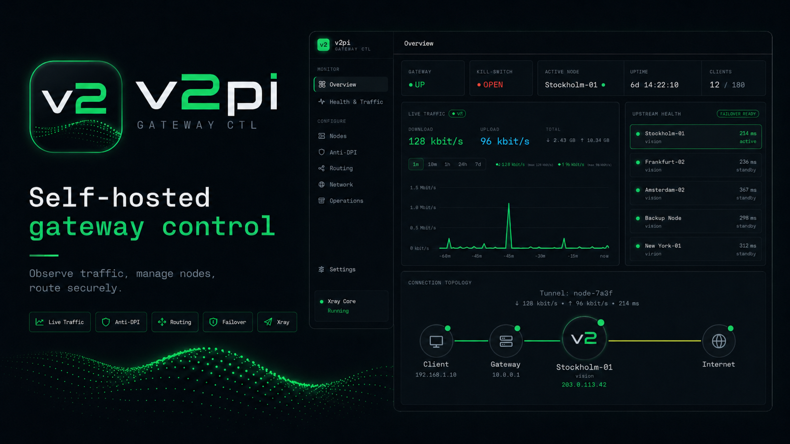

<div align="center">



<br/>

**Веб-панель, которая превращает выделенную Linux-коробку в управляемый [Xray](https://github.com/XTLS/Xray-core) VPN-шлюз.** Ноды, тюнинг anti-DPI, маршрутизация по правилам, автопереключение на живую ноду, удалённый доступ и полное управление сетью хоста. Без монитора и клавиатуры.

<br/>

[](https://github.com/pinusmassoniana/v2pi/actions/workflows/ci-release.yml)
[](https://github.com/pinusmassoniana/v2pi/releases)
[](LICENSE)
[](https://github.com/pinusmassoniana/v2pi/pkgs/container/v2pi-x)


<br/>

[English](README.md) · **Русский**

[Зачем](#зачем-v2pi) · [Возможности](#возможности) · [Быстрый старт](#быстрый-старт-docker) · [Настройка роутера](#настройка-роутера) · [Конфигурация](#конфигурация) · [На чём протестировано](#на-чём-протестировано) · [Разработка](#разработка)

</div>

## Зачем v2pi

Интернет в России теперь с сюрпризами: один сайт «недоступен», другой открывается через раз, видео
грузится по полдня. Обычный ответ — поставить VPN-приложение. Только оно живёт на одном устройстве,
периодически отваливается или пропадает из магазина, а телевизор, приставку, умные лампочки и телефон
гостя им всё равно не прикрыть.

v2pi заходит с другой стороны: защищается не каждое устройство, а вся сеть. Одна небольшая коробка
работает круглосуточно и становится шлюзом для целого сегмента. Всё, что в него попало, по кабелю или
по Wi-Fi, с VPN-клиентом или без, прозрачно уходит в туннель
[Xray](https://github.com/XTLS/Xray-core). Настраивать каждое устройство не нужно: подключил к сети,
и оно уже под защитой. Для домашних всё выглядит буднично: интернет снова открывается целиком, почти
как в 2007-м.

При этом в туннель уходит не всё подряд.

Правила geoip/geosite пускают российские и локальные сайты напрямую, так что банки, госуслуги и местные
сервисы работают как обычно и быстро, а через прокси идёт только то, что иначе не открыть. Пресет
«RU напрямую» включается в один клик.

Задача — реально проходить через DPI, поэтому ноды говорят на VLESS Vision, XHTTP и REALITY, и у каждой
свой профиль тюнинга: uTLS-fingerprint, фрагментация TLS, mux, DoH. Изменения применяются к живому
туннелю, а не после перезапуска.

Если туннель упал, kill-switch останавливает сегмент, вместо того чтобы дать ему тихо откатиться на
«голое» соединение. Активные проверки сами переводят трафик на живую ноду, а после перезагрузки шлюз
поднимается в рабочем состоянии. Ночью бежать передёргивать провода не придётся.

Крутится это на вашем железе, без стороннего приложения, которое в любой момент могут заблокировать, и
без клиента на каждом устройстве. Дашборд показывает трафик, состояние нод и все выданные адреса.

Образ публикуется для amd64 и arm64, но это не обычная нагрузка «для любого Docker-хоста». Нужны Linux
host networking, описанные интерфейсы и привилегии апплайанса на коробке, выделенной под эту задачу.

## Возможности

<table>
<tr>
<td width="50%" valign="top">

### Ноды
Управление нодами Xray: VLESS Vision и XHTTP, включая XHTTP-over-TLS. Подписки умеют инъекцию
произвольных заголовков и query-параметров и сохраняют порядок из фида при импорте.

</td>
<td width="50%" valign="top">

### Тюнинг anti-DPI
Профили для каждой ноды: uTLS-fingerprint, фрагментация TLS, mux, DoH, QUIC и остальные ручки.
Применение профиля кратковременно перезапускает Xray и переподключает туннель.

</td>
</tr>
<tr>
<td width="50%" valign="top">

### Маршрутизация
Упорядоченные правила (`geoip` / `geosite` / domain / ip / port в direct, proxy или block) со
стейджингом пресетов, валидацией каждого правила и готовым пресетом «RU напрямую».

</td>
<td width="50%" valign="top">

### Здоровье и трафик
Активные пробы с автопереключением на живую ноду и график входящего и исходящего трафика в реальном
времени по статистике Xray через WebSocket.

</td>
</tr>
<tr>
<td width="50%" valign="top">

### Управление сетью
Редактируемая сеть шлюза (интерфейс и IP сегмента, диапазон DHCP, DNS для клиентов) с fail-closed
kill-switch. Применяется к хосту как настоящий nftables tproxy и policy-routing.

</td>
<td width="50%" valign="top">

### Удалённый доступ
Входящий VLESS/Reality, чтобы свои устройства подключались к шлюзу снаружи и попадали в домашнюю сеть.
Отдельный доступ на каждое устройство, отзывается по одному, конфиг клиента готов к импорту.

</td>
</tr>
<tr>
<td colspan="2" valign="top">

### Эксплуатация
Резервное копирование и восстановление, настройка администратора при первом запуске, светлая и тёмная
тема, самовосстановление после перезагрузки.

</td>
</tr>
</table>

## Быстрый старт (Docker)

Нужен 64-битный Linux-хост (amd64 или arm64, headless — норма) с Docker и Docker Compose.

Установка с нуля:

```bash
git clone https://github.com/pinusmassoniana/v2pi.git
cd v2pi
cp .env.example .env
# Впишите в .env digest манифеста из выбранного релиза.
docker compose pull
docker compose up -d
```

Откройте `https://<ip-устройства>:8080` и завершите настройку администратора. Одноразовое доказательство
записано в `/data/bootstrap_token` с правами `0600`, один раз печатается в stderr контейнера и
удаляется после успешной настройки. При LAN-bind панель берёт заданную пару сертификат/ключ или создаёт
и хранит `/data/tls.crt` и `/data/tls.key`. Проверьте этот сертификат до того, как вводить пароль. HTTP
разрешён, только когда панель привязана к loopback.

Новая установка намеренно fail-closed: пока нода не настроена и не подключена, у клиентского сегмента
нет выхода в интернет. Так и должно быть при первом запуске, это не авария.

Обновление на выбранный и проверенный immutable digest:

```bash
cd v2pi
git pull                 # обновить docker-compose.yml, если менялся
${EDITOR:-vi} .env       # заменить V2PI_IMAGE на новый ...@sha256:<digest>
docker compose pull
docker compose up -d
```

> [!WARNING]
> Готовый Compose-файл запускает контейнер `privileged` с `network_mode: host`, чтобы он владел всем
> шлюзом на хосте: sysctl, клиентский VLAN, адресация, DHCP, IPv6 RA. Таков размен за выделенную
> коробку под одну задачу. Убрать `privileged` можно только после приёмки cutover и принудительного
> отката на целевом железе: одних `cap_add` для нужных sysctl не хватает.

Опубликованный образ — `ghcr.io/pinusmassoniana/v2pi-x`, мультиарх-манифест для `linux/amd64` и
`linux/arm64`. Compose требует `V2PI_IMAGE` в каноническом виде `image@sha256:digest`, и Docker сам
выбирает из него нужную архитектуру. Теги релизов нужны, чтобы найти версию, а не чтобы её
разворачивать. В образ вшиты зафиксированный Xray-core плюс `nftables`, `dnsmasq`, `isc-dhcp-client` и
`iproute2`, и на `up` он сам разворачивает весь шлюз на хосте: хосту не нужно ничего, кроме Docker, а
вам остаётся настроить роутер.

Для разработки собирайте Dockerfile напрямую (`docker build -t v2pi-local .`) или используйте
неконтейнерный цикл из [CONTRIBUTING.md](CONTRIBUTING.md). Сборка через Compose требует той же замены,
потому что Compose помечает собранный образ значением `image:`, а digest тегом быть не может:
`V2PI_IMAGE=v2pi-local docker compose up --build`. Не оставляйте мутабельный локальный тег вместо
production-digest на боевом шлюзе.

## Настройка роутера

Шлюзом владеет панель. Роутер — единственная коробка, которую она не трогает, и настраивается он один
раз:

- Создайте клиентский VLAN (по умолчанию VLAN 2) и протегируйте в него клиентский порт свитча.
- Отключите DHCP роутера на этом VLAN, его раздаёт шлюз.
- Домашнюю ногу шлюза (`eth0`) держите в обычной LAN с интернетом.

> [!IMPORTANT]
> Если используете IPv6, отключите IPv6 и Router Advertisement роутера на этом VLAN. RA раздаёт сам
> шлюз, а второй источник заставит клиентов течь мимо туннеля. Панель это детектит и показывает
> красный баннер.

Экран Network проверяет каждый пункт и показывает точные шаги.

<details>
<summary><b>Миграция существующей ручной установки</b></summary>

<br/>

Если раньше вы вручную поднимали `pi-gw-dhcp.service`, `radvd` или VLAN, один раз запустите на хосте от
root `scripts/migrate-host.sh`. Он снимет снапшот, остановит легаси-сервисы хоста, передаст сегмент
контейнеру и проверит результат, а при ошибке откатится. Чистым установкам это не нужно.

</details>

## Конфигурация

> [!TIP]
> Для Compose-деплоя обязателен `V2PI_IMAGE`. Runtime-параметры задаются в `.env` (см.
> [`.env.example`](.env.example)). Не коммитьте секреты и приватные ключи.

| Переменная | По умолчанию | Назначение |
|---|---|---|
| `PI_GW_SESSION_SECRET` | генерируется, сохраняется | ключ подписи cookie сессии |
| `PI_GW_BIND_HOST` | `0.0.0.0` | адрес прослушивания (доступ по LAN, под логином) |
| `PI_GW_PORT` | `8080` | HTTPS-порт для LAN-bind; HTTP только на loopback |
| `PI_GW_TLS_CERT` / `PI_GW_TLS_KEY` | генерируются для LAN-bind | пути к PEM-сертификату и ключу; задаются парой |
| `PI_GW_DATA_DIR` | `/data` (в образе) | SQLite, конфиг Xray, логи, секрет сессии |
| `PI_GW_XRAY_BIN` | `xray` | путь к бинарю Xray |
| `PI_GW_NET_BACKEND` | `linux` (Compose) / `dryrun` (dev) | `linux` применяет nft, routing и dnsmasq к хосту; иначе только рендер |
| `PI_GW_MGMT_IFACE` / `PI_GW_MGMT_IP` | `eth0` / `192.168.1.120` | management/uplink-интерфейс и адрес |
| `PI_GW_SEGMENT_IFACE` / `PI_GW_SEGMENT_IP` | `eth0.2` / `192.168.10.2` | клиентский интерфейс и адрес шлюза |
| `PI_GW_DHCP_START` / `PI_GW_DHCP_END` / `PI_GW_DHCP_LEASE` | `192.168.10.30` / `.200` / `12h` | DHCP-пул и аренда |
| `PI_GW_CLIENT_DNS` / `PI_GW_CLIENT_DNS6` | `1.1.1.1` / Cloudflare IPv6 | DNS, выдаваемый клиентам |

> [!NOTE]
> Dev и CI по умолчанию используют dry-run сетевой бэкенд (`PI_GW_NET_BACKEND` не задан или `dryrun`).
> Он рендерит наборы правил nftables и dnsmasq, но не трогает хост, так что панель можно безопасно
> запускать на ноутбуке. Реально применяет изменения только `PI_GW_NET_BACKEND=linux`.

Области API-токенов намеренно разные. `monitor` читает статус, историю здоровья и несекретную
телеметрию. `read` и `readwrite` — административные области, которые могут раскрыть секретную
конфигурацию, храните их как учётные данные. Восстановление бэкапа проверяет документ до того, как
что-то заменить, восстанавливает сетевое и guard-намерение и всегда завершается в состоянии
disconnected, чтобы восстановленную ноду вы просмотрели и подключили сами.

## На чём протестировано

Релизная автоматизация собирает и smoke-тестирует точные digest для обеих опубликованных архитектур:
amd64 нативно, arm64 под QEMU. Ниже референсные среды, а не обещание совместимости с любым Linux-хостом
или топологией.

<details open>
<summary><b>amd64</b> виртуальная машина Proxmox VE <sub>(текущий референс)</sub></summary>

<br/>

| | |
|---|---|
| Платформа | Виртуальная машина Proxmox VE (KVM/QEMU) |
| vCPU | 4 × AMD Ryzen 5 8645HS (x86-64) |
| ОЗУ | 4 ГБ |
| ОС | Ubuntu 24.04.4 LTS, ядро `6.8.0-136-generic` |
| Движок контейнеров | Docker 29.5 |
| Встроенный Xray-core | v26.3.27 (`linux/amd64`) |

</details>

<details>
<summary><b>arm64</b> Raspberry Pi 5 Model B</summary>

<br/>

| | |
|---|---|
| Плата | Raspberry Pi 5 Model B Rev 1.1 (BCM2712) |
| CPU | 4 ядра Arm Cortex-A76 @ 2.4 ГГц (aarch64) |
| ОЗУ | 16 ГБ |
| ОС | Debian GNU/Linux 13 (trixie), ядро `6.12.75+rpt-rpi-2712` |
| Движок контейнеров | Docker 26.1 |
| Встроенный Xray-core | v26.3.27 (`linux/arm64`) |

</details>

Перед боевым трафиком проведите приёмку на целевом шлюзе: нативный data-path и cutover, проверки утечек
DNS и IPv4/IPv6, readiness, принудительный откат и восстановление прежней сети хоста. Портативный
локальный и CI-набор этого доказать не могут.

## Разработка

См. [CONTRIBUTING.md](CONTRIBUTING.md). Вкратце:

```bash
cd backend  && uv run --locked pytest  # тесты бэкенда
cd frontend && npm ci && npm run check && npm test
cd backend  && uv run --locked python -m pi_gw_panel  # локально, сетевой dry-run
```

## Лицензия

[AGPL-3.0](LICENSE) © Pinus Massoniana

Флаги стран у egress используют базу
[DB-IP IP-to-Country Lite](https://db-ip.com/db/download/ip-to-country-lite) от DB-IP по лицензии
[CC BY 4.0](https://creativecommons.org/licenses/by/4.0/). Она вшита в образ и обновляется при каждой
пересборке.
